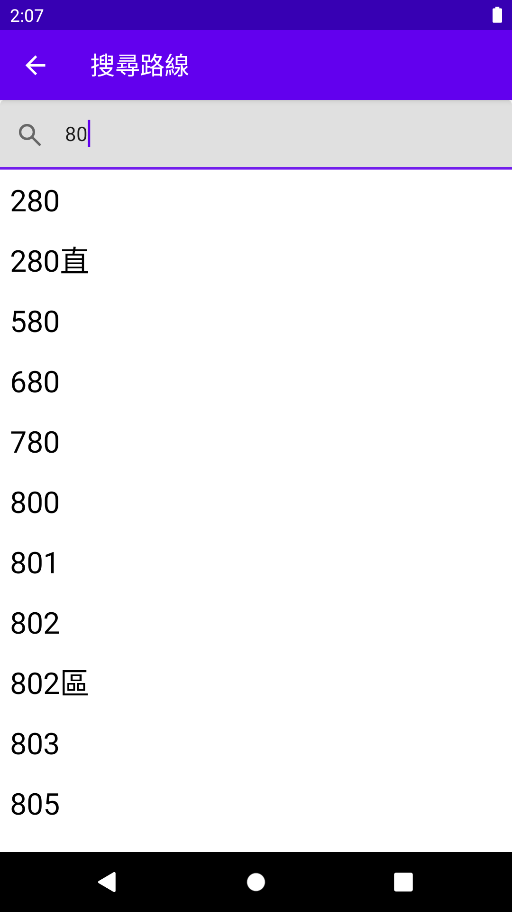

# EasyBus

EasyBus是一個使用Android Jetpack Compose + Clean Architecture 組合開發的APP，提供使用者查詢公車路線資訊功能。

## Screenshots

|                             首頁                             |                         公車路線動態                         |                         路線動態功能                         |
| :----------------------------------------------------------: | :----------------------------------------------------------: | :----------------------------------------------------------: |
|  |  |  |
|                      **查詢附近公車站**                      |                   **查看路線其他公車資訊**                   |                       **搜尋公車路線**                       |
|  |  |  |

## Technologies

Program Language: `Kotlin`

Framework: `MVVM` + `Clean Architecture`

UI: `Compose`、`Navigation`

DI: `Hilt`

Persistence Data: `Room`

Network: `Retrofit`

Test:  `JUnit`、`Mockito`

## Setup

* 至[PTX公共運輸整合資訊流通服務平台](https://ptx.transportdata.tw/PTX/)申請API ID\Key

* 至[GoogleMap](https://developers.google.com/maps)服務申請Map Api Key
* Download或Clone 此專案
* 打開[string.xml](app/src/main/res/values/string.xml) 將先前申請的 API ID、API Key 帶入